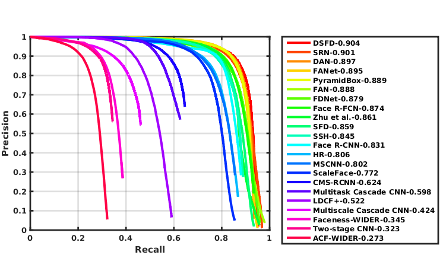

# Single Shot Faces Detectors in TensorFlow

This repository contains the *un-official* reimplementation of several single shot faces detectors in TensorFlow.

- [S³FD: Single Shot Scale-invariant Face Detector](https://arxiv.org/pdf/1708.05237.pdf). Click [here](https://github.com/sfzhang15/SFD) for official codes in Caffe (evaluation only). 
- [PyramidBox: A Context-assisted Single Shot Face Detector](https://arxiv.org/pdf/1803.07737.pdf). Click [here](https://github.com/PaddlePaddle/models/tree/develop/fluid/PaddleCV/face_detection) for official codes in PaddlePaddle. 
- DAN(Dynamic Anchor routing Network): A novel framework try to conduct inplace cascaded faces detection.

## ##
## Usage
- Download [WIDER Face Dataset](http://mmlab.ie.cuhk.edu.hk/projects/WIDERFace/index.html) and reorganize the directory as follows:
	
	```
	WIDER Face Dataset/
	   |->WIDER_train/
	   |    |->images/
	   |    |->...
	   |->WIDER_val/
	   |    |->images/
	   |    |->...
	   |->WIDER_test/
	   |    |->images/
	   |    |->...
	   |->wider_face_split/
	   |    |->wider_face_train.mat
	   |    |->...
	'''
	WIDER_ROOT is your path of the WIDER Face Dataset.
- Run the following script to generate TFRecords.
	
	```sh
	python dataset/convert_tfrecords.py --dataset_directory=WIDER_ROOT --output_directory=./dataset/tfrecords
	```
- Download the **pre-trained VGG-16 model (reduced-fc)** from [here](https://drive.google.com/drive/folders/184srhbt8_uvLKeWW_Yo8Mc5wTyc0lJT7) and put them into one sub-directory named 'model' (we support SaverDef.V2 by default, the V1 version is also available for sake of compatibility).
- Compile custom operations, run following command in directory 'cpp/Deform' and 'cpp/ExtraLib' (ignore this step if you just try S³FD or PyramidBox):
	
	```sh
	mkdir build
	cd build && cmake ..
	make
	```
- Run the following script to start training:

	```sh
	python train_dan.py (or python train_pb.py for PyramidBox, or python train_sfd.py for S³FD)
	```
- Run the following script to get detection results in *.txt (modify the WIDER_ROOT in 'data_dir' firstly):

	```sh
	python eval_dan.py (or python eval_pb.py for PyramidBox, or python eval_sfd.py for S³FD)
	```
- Run the official MATLAB script for evaluation

All the codes was tested under TensorFlow 1.8, Python 3.5, Ubuntu 16.04 with CUDA 8.0. You need at least two decent GPUs for training by yourself. 

## ##
## Framework


## ##
## Results

Reproduced results are list as follows:

| Algorithm   | Easy  | Medium | Hard
|:-------|:-----:|:-------:|:-------:|
|  S³FD  |  0.933 |  0.923   |   0.848  | 
| PyramidBox  |  0.955 |  0.946   |   0.888  |  
| DAN  |  0.958 | 0.946   |   0.895  | 
| DAN-Deform  |  0.957 |  0.947   |   0.897  |  

The performance of PyramidBox could be further improved by using transposed convolution in LFPN and tuning the weight of losses. While the training peroid is too long to perform more experiments.




You can download the trained model of DAN from [GoogleDrive](https://drive.google.com/open?id=1m1FsB4eym81tD1WtIQL5KRi7MVDJRCWo).

## Discussion

Welcome to join in QQ Group(758790869) for more discussion

## ##
Apache License, Version 2.0
